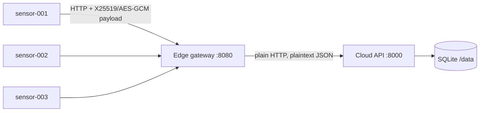
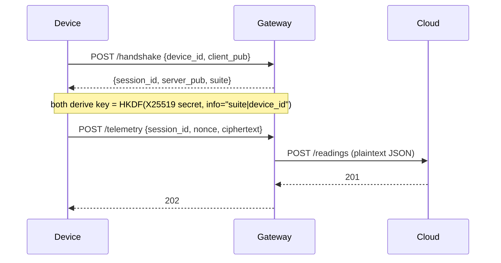

# Baseline architecture (legacy, pre-PQC)

## Components
| Component | Role | State |
|---|---|---|
| Device (`device/device.py`) | Generates readings every 3 s, runs the handshake, encrypts payloads | Ephemeral X25519 key; session key in memory |
| Gateway (`gateway/gateway.py`) | `/handshake`, `/telemetry`, `/health`; decrypts and forwards | In-memory `sessions` dict |
| Cloud (`cloud/cloud.py`) | `/readings`, `/health`; stores readings | SQLite on a volume |
| Crypto (`common/kex_legacy.py`) | X25519 ECDH, HKDF-SHA256, AES-256-GCM | Stateless |

## Handshake and data flow

## Trust boundaries
- Device <-> gateway: payload encrypted, **but the gateway is not authenticated**.
- Gateway <-> cloud: **no encryption, no authentication**.
- Cloud storage: plaintext in SQLite.

## Where quantum risk sits
X25519 is broken by a quantum computer (Shor). Anyone recording device<->gateway traffic today can decrypt it later
("harvest now, decrypt later"). Only the device<->gateway handshake is in scope for ML-KEM.
